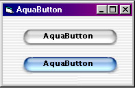



## Aqua Button

### Description

Once again .... its a button ... :) and what does a button do ?? Anyway, this button is inspired by the Aqua interface of MAC OS X :) I'm not a mac fan but .... sure wish Microsoft would do something about their interface ... Luna is a good start :)
 
### More Info
 
aching finger ....

             |
---                |---
**Submitted On**   |2001-09-20 21:22:18
**By**             |[Janarayson](https://github.com/Planet-Source-Code/PSCIndex/blob/master/ByAuthor/janarayson.md)
**Level**          |Beginner
**User Rating**    |4.6 (65 globes from 14 users)
**Compatibility**  |VB 6\.0
**Category**       |[Custom Controls/ Forms/  Menus](https://github.com/Planet-Source-Code/PSCIndex/blob/master/ByCategory/custom-controls-forms-menus__1-4.md)
**World**          |[Visual Basic](https://github.com/Planet-Source-Code/PSCIndex/blob/master/ByWorld/visual-basic.md)
**Archive File**   |[Aqua Butto267199202001\.zip](https://github.com/Planet-Source-Code/janarayson-aqua-button__1-27408/archive/master.zip)

